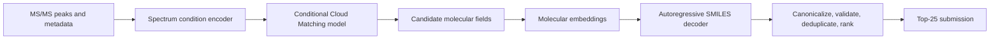

# MolAI

MolAI is a research workspace for the
[Enveda CASMI 2026 molecule identification competition](https://www.kaggle.com/competitions/enveda-CASMI26-molecule-id-mass-spectra).
The long-term task is to infer a ranked set of molecular structures from one or more
MS/MS spectra. This repository investigates an intermediate-representation approach:
instead of translating spectra directly into a SMILES string, the model first learns a
spatial molecular field and then decodes the field into a structure.

## Research overview

### Research question

Can a dense, chemically structured 2D field provide a more useful bridge between mass
spectra and molecular structure than direct spectrum-to-SMILES generation?

The working hypothesis is that a molecular field gives the model a continuous target in
which local atomic environments, bond regions, charge distribution, delocalization, and
stereochemical cues can be learned before the exact discrete SMILES syntax is required.
It also makes the intermediate result inspectable and allows the representation itself to
be tested for collisions and structural recoverability.

The intended competition pipeline is:



Field pretraining is performed in the reverse direction available from labelled molecular
structures: a SMILES condition is paired with a deterministic or physics-inspired field.
Once that field prior is learned, the SMILES condition encoder can be replaced by the
spectrum encoder because both produce the same fixed-width conditioning vector.

### What is implemented

- Three molecular-field teachers: a fast graph-derived electron cloud, a 2D orbital-free
  pseudo-DFT solver, and a higher-cost 2D valence Kohn-Sham solver.
- Deterministic RDKit-based molecular standardization and 2D coordinate normalization.
- Resumable, sharded field generation with convergence and charge-conservation metadata.
- A full-resolution conditional Cloud Matching architecture with local and axial attention.
- SMILES and multi-spectrum condition encoders with a shared conditioning interface.
- An autoregressive SMILES head and a smaller image-to-SMILES probe for measuring how much
  structural information survives in a field.

The end-to-end spectrum-conditioned training, candidate-ranking, and submission pipeline
is not yet complete. The current codebase is focused on validating the field representation
and pretraining the molecular-field prior; it should not yet be read as a finished CASMI
solution.

## Representation and processing

### 1. Molecule normalization and layout

For the pseudo-DFT teachers, RDKit cleans and canonicalizes each molecule, canonicalizes
its tautomer, removes stereochemistry, and generates a deterministic 2D depiction.
Coordinates are centered and scaled using the median bond length and configured canvas
margin. Effective nuclear charge is based on valence electrons; implicit hydrogens can be
collapsed into their parent heavy atoms to keep the layout readable while preserving the
electron count.

The graph-derived renderer follows a separate, stereochemistry-preserving path. It uses
explicit hydrogens by default and canonical isomeric SMILES so that the representation can
be tested for exact-structure recovery.

### 2. Molecular-field teachers

The available targets trade physical fidelity for generation speed:

| Teacher | Purpose | Main signal | Important limitation |
| --- | --- | --- | --- |
| Graph-derived cloud | Fast structure-first ablations and large-scale data generation | Atom cores, valence/lone-pair clouds, bond order, aromatic/conjugated delocalization, charge polarity, and R/S or E/Z marks | Deterministic chemical rendering, not a quantum observable |
| Orbital-free | Fast physics-inspired warm-up | 2D Thomas-Fermi-Weizsaecker, Hartree, exchange, nuclear, and electron-density terms | No explicit orbitals |
| Kohn-Sham | Smaller, higher-quality teacher subset | Occupied orbitals, self-consistent electron density, and signed charge density | Effective 2D valence model, not converged 3D quantum chemistry |

All final learning targets are bounded single-channel fields. Positive compact regions
represent effective nuclei and negative continuous regions represent the electron cloud.
The Kohn-Sham path deposits each effective nucleus into at most four neighboring pixels
with charge-conserving bilinear interpolation. A symmetric softsign maps the signed density
to a bounded image without destroying invertibility. Raw orbital stacks are diagnostics,
not training targets, because their channel count varies by molecule and orbital phase is
not a stable image label.

The graph-derived renderer builds smooth Gaussian and elliptical primitives on the CPU,
then pools and rasterizes them in bounded chunks on the selected Torch device. Its fused
field is accompanied by separate core, atom-cloud, bond-cloud, delocalization, and stereo
channels for inspection.

### 3. Dataset generation

`scripts/generate_dft_dataset.py` reads unique structures from Parquet, CSV, SMILES text,
SDF, or compressed SDF input. Molecules are processed in batches and written as float16
Torch shards. `manifest.json` records the source offset, solver configuration hash,
successful and failed records, convergence state, iteration count, final change, integrated
charge, and solver-specific energy diagnostics.

Generation is resumable: rerunning with the same source and solver configuration continues
from the recorded offset. A different source or configuration is rejected to prevent
incompatible fields from being mixed silently.

### 4. Cloud Matching pretraining

The pretraining path corrupts each clean field with a variance-preserving diffusion
schedule. For a randomly selected noisy state, it analytically samples several posterior
targets at an earlier noise level, including clean-field jumps. The model predicts an
empirical cloud of possible corrections rather than a single deterministic image.

The generator keeps the full input resolution; it reduces feature width instead of
patchifying or downsampling the field. A low-rank row/column condition plane injects the
conditioning vector, while shifted local-window, row-axial, and column-axial attention
propagate information without quadratic global image attention. A learned spatial noise
energy controls per-pixel stochasticity. The training objective is a stride-free,
multi-band energy distance between predicted and target correction clouds, plus an optional
autoregressive SMILES loss.

The default Kohn-Sham grid is `192 x 192`. `max_resolution: 256` reserves space for later
resolution ablations; it does not resize the input automatically.

### 5. Spectrum conditioning and decoding

`SpectrumConditionEncoder` treats the peaks of each spectrum as a set. It Fourier-encodes
normalized m/z and intensity, combines mean and max peak summaries with spectrum metadata,
then aggregates all spectra belonging to the same molecule. This produces the same
conditioning width as `SmilesConditionEncoder`.

The generated field tokens are mean-pooled into molecular embeddings and passed to an
autoregressive GRU SMILES decoder. The planned inference stage will validate generated
SMILES with RDKit, canonicalize and deduplicate them, rank candidates across sampled field
clouds, and retain at most 25 predictions for each `molecule_id`.

## Repository structure

```text
MolAI/
├── configs/                  # Field-solver and Cloud Matching hyperparameters
├── data/                     # Local competition data and generated shards (Git-ignored)
├── scripts/
│   ├── check_environment.py  # CUDA, RDKit, and competition-schema checks
│   ├── generate_dft_dataset.py
│   ├── preview_*.py          # Field and diagnostic visualizations
│   ├── evaluate_electron_cloud.py
│   └── train_cloud.py        # Structure-conditioned field pretraining entry point
├── src/molai/
│   ├── dft/                  # Layout, orbital-free, Kohn-Sham, and shard writer code
│   ├── fields/               # Graph-derived electron-cloud renderer
│   └── models/               # Encoders, attention, bridge, losses, field model, decoder
└── tests/                    # Charge, determinism, representation, and model tests
```

The main code flow is:

```text
structure input
  -> canonical layout / graph compilation
  -> graph, orbital-free, or Kohn-Sham field teacher
  -> sharded field dataset
  -> VP bridge sampling
  -> condition plane + full-resolution field model
  -> field samples + molecular embeddings
  -> SMILES decoder
```

## Environment

The project uses Python 3.12, PyTorch with the official CUDA 13.2 runtime, and the same
RDKit version (`2026.03.3`) used by the competition evaluator.

```powershell
uv python install 3.12
uv sync
uv run python scripts/check_environment.py
```

Start JupyterLab with:

```powershell
uv run jupyter lab
```

### NVIDIA CUDA container

The remote GPU environment is pinned to the CUDA 13.2 PyTorch wheel and an NVIDIA CUDA
13.2 development image. Build and verify it with:

```bash
docker compose build
docker compose run --rm molai python scripts/check_environment.py --skip-data
```

For an interactive shell with the repository and local `data/` directory mounted:

```bash
docker compose run --rm molai bash
```

The host needs a sufficiently recent NVIDIA driver, Docker, and NVIDIA Container Toolkit;
the host does not need a separate CUDA toolkit. `--gpus all` is supplied by Compose and
`ipc: host` avoids the small default shared-memory limit during multi-worker training.

Competition files belong in `data/` and are intentionally ignored by Git:

- `data/train.parquet`
- `data/test.parquet`
- `data/sample_submission.csv`

The submitted file must be named `submission.csv`. Each test `molecule_id` appears once,
with up to 25 ranked SMILES joined by semicolons.

## Experiments

### Preview the graph-derived electron cloud

```powershell
uv run python scripts/preview_electron_cloud.py `
  --smiles "CC(=O)Oc1ccccc1C(=O)O" `
  --resolution 192
```

### Evaluate representation sufficiency

Test whether the graph-derived representation retains enough information to reconstruct a
molecule:

```powershell
uv run python scripts/evaluate_electron_cloud.py `
  --input data/train.parquet `
  --limit 2000 `
  --resolution 96 `
  --render-batch-size 32 `
  --epochs 8
```

The JSON report contains exact 8-bit image collisions, nearest-neighbor image RMSE,
canonical-SMILES recovery, connectivity recovery, and SMILES validity. A paired checkpoint
stores the full-resolution CNN probe and tokenizer vocabulary. This probe measures
information retention; it is not the final spectrum-to-structure model.

### Generate Kohn-Sham field shards

```powershell
uv run python scripts/generate_dft_dataset.py `
  --config configs/kohn_sham.yaml `
  --input data/train.parquet `
  --output data/kohn_sham_fields
```

The manifest keeps non-converged samples auditable rather than silently treating them as
converged.

### Pretrain the field model

```powershell
uv run python scripts/train_cloud.py `
  --data data/kohn_sham_fields `
  --config configs/model_ks.yaml
```

### Preview Kohn-Sham diagnostics

```powershell
uv run python scripts/preview_kohn_sham.py --smiles "c1ccccc1"
uv run python scripts/preview_kohn_sham.py --smiles "c1ccccc1" --diagnostics
```

Direct Kohn-Sham generation over all available chemical structures is intentionally not
the plan. The expected scaling strategy is to generate a curated, converged teacher subset,
train a fast field surrogate, and use that surrogate for larger-scale experiments.

## Tests

```powershell
uv run pytest
```

The tests cover deterministic layouts, charge conservation, orbital orthonormality,
bounded fields, bond polarity, delocalization and stereochemistry signals, batched rendering,
Cloud Matching shapes and gradients, and SMILES tokenization.
